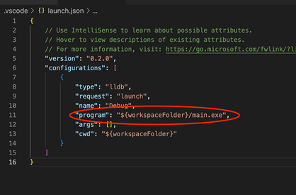

# 2 IDEs

[TOC]

## **2.1 VScode for Mac & WSL/Linux**

### **2.1.1 Installation and Project Basis**

#### 2.1.1.1 Downloading VSCode for Mac

VSCode is a lightweight, easy-to-use, source code editor with debugging support.

 It runs on macOS, Windows, and Linux (including CAEN Linux).

**(1) Download on Mac**

首先确保你下载了compiler and a debugger. 

1. MacOS默认的compiler是 **Apple clang**, 但是它用的是 `g++` 的名字(怪). debugger用的是**lldb**.

   至于具体怎么装我们实际上已经在install CLI tools的时候装过了. 我们通过 `$ xcode-select --install` 安装了夹带在xcode中的 Apple LLVM which pretends to be g++, 以及lldb debugger.

   ```shell
   xcode-select --install
   ```

2. 检查版本.

   ```shell
   g++ --version
   # Apple clang version 13.1.6 (clang-1316.0.21.2.5)
   lldb --version
   # Apple Swift version 5.6.1 (swiftlang-5.6.0.323.66 clang-1316.0.20.12)
   ```

3. 还有一件事，就是确保你的Mac版本在11.1以上. 

   ```shell
   sw_vers
   # ProductName:   macOS
   # ProductVersion: 14.2
   ```

4. 安装VSCode

   ```shell
   brew install --cask visual-studio-code
   ```

5. 安装extension packages: [C/C++ extension](https://marketplace.visualstudio.com/items?itemName=ms-vscode.cpptools) , [CodeLLDB extension](https://marketplace.visualstudio.com/items?itemName=vadimcn.vscode-lldb).  

   ```shell
   code --install-extension ms-vscode.cpptools
   code --install-extension vadimcn.vscode-lldb
   ```

   list extension以确认.

   ```shell
   code --list-extensions
   ```

**(2) Download on WSL/Linux**

1. 同样，下载compiler和debugger. Windows/WSL中compiler用**g++**, debugger用**gdb**. 我们在安装CLI工具的时候也干过了. 原生linux也一样.

   ```shell
   sudo apt install g++ gdb
   ```

2. 检查版本.

   ```shell
   g++ --version
   # g++ (GCC) 8.5.0 20210514
   gdb --version
   # GNU gdb (GDB)
   ```

3. 安装VSCode

   直接通过 https://code.visualstudio.com/ 安装.

4. 安装WSL Extension，使得VS Code backend能够在WSL上运行(原生linux不用), which is where our installed g++ compiler lives.

   

   5. VS Code连接到WSL Ubantu. 首先点击左下蓝色图标，然后在跳出的 **Command Palette(Ctrl+Shift+P)** 选择"Connect to WSL". 选择完之后蓝色的图标会显示你在WSL Ubantu Mode下运行. (原生linux不用)

      

      

      **一定要确保在WSL下运行！！** 如果accientally opened the folder in Windows Mode, 那么就点击Ctrl+shift+P打开Command Palette并选择"WSL: Reopen Folder in WSL". 同样，过程中如果跳出 "Unable to start debugging" 窗口也要 Reopen Folder in WSL.

5. 在Sidebar中下载名字为 **"C/C++"**的extension.

#### 2.1.1.2 Create a project and open it with VSCode

比如

```shell
mkdir ~/eecs280
cd ~/eecs280
mkdir p1-stats
cd p1-stats
```

**Pitfall:** Avoid paths that contain spaces.  Spaces causes problems with some command line tools.

| Bad Example        | Good Example |
| ------------------ | ------------ |
| `EECS 280/`        | `eecs280/`   |
| `Project 1 Stats/` | `p1-stats/`  |

a quick way to open VS Code to a specific project folder from the command line.  但是首先要用 `ls` 确认你现在在项目文件夹中.

```shell
ls
# main.cpp ...
code .
```

**注意：如果你在使用WSL，那么你的项目应当创建在Ubantu下的directory中而不是Windows下的. 否则会slowdown running speed.**

```shell
pwd
# /home/awdeorio ...         # Good, Linux home
# /c/mnt/Users/awdeorio ...  # Bad, Windows home
```

#### 2.1.1.3 Create new files 创造新文件

先navigate to working directory，然后如下（例如，创建一个 `main.cpp` 的文件

```shell
touch main.cpp
```

#### 2.1.1.4 Downloading from Internet and adding existing files 下载文件与添加现有文件

先navigate to working directory，然后这里是从网上下载文件压缩包，解压并移动到working directory一条龙.

```shell
wget https://eecs280staff.github.io/p1-stats/starter-files.tar.gz
## 从该网页下载
tar -xvzf starter-files.tar.gz
## 解压
mv starter-files/* .
## 把stater-files下所有文件移动到working directory
rm -rf starter-files starter-files.tar.gz
## 删除下载文件
```

#### 2.1.1.5 Rename Files 文件重命名

`mv` 指令如果是move文件到文件，而不是到文件夹，意思就是重命名文件.

```shell
mv stats_tests.cpp.starter stats_tests.cpp
```

### **2.1.2 Compile and Run: 配置 `launch.json` 文件**

#### 2.1.2.1 Create `.exe` file

VSCode需要一个executable文件来compile and run. 也就是 `.exe` 文件.  我们通过command line创建一个. 

```shell
touch stats.cpp  
# Needed for EECS 280 p1
make main.exe
# make是Makefile的clt指令. 这个时候我们还没学makefile, 但是老师肯定会在Project tar里给你一个Makefile文件
./main.exe
# 跑一下. 需要代码能正常运行才能正常跑
```

如果你的老师真的没给你Makefile的话（逆天），那么你也可以创建一个.exe并compile manually. 

```shell
g++ -g main.cpp -o main.exe
```

本质上就是只要compile main.cpp就可以了，其他的files都被linker通过header file给 include进了main.cpp. 

#### 2.1.2.2 Create and edit `launch.json` 

1. 在左侧的 SideBar 中 navigate 到 “Run and Debug", 在其中点击 **Create a launch.json file**, 然后会跳出 **Select debugger**. **如果是macOS, 则选择 `LLDB`**;  **如果是WSL/Linux, 则选择C++ GDB/LLDB**。

2. 点击下方的 **“Add Configuration"**. 然后WSL选择 **"C/C++: (gdb) Launch"**. **注意不是Attach而是Launch.** MacOS选择 **"C/C++: (lldb) Launch"**

3. 更改 `launch.json` 中的 "program" 为 `"{workspaceFolder}/main.exe"`. 前提是你的exe文件叫 `main.exe ` ,总之就是运行你的exe文件.

4. 更改 "cwd" 为 `"{workspaceFolder}"` 如果它不是.

   ```json
   {
       "program": "${workspaceFolder}/main.exe",
       ...
       "cwd": "${workspaceFolder}",
   }
   
   ```

   

5. 如果出现未知的问题，delete your `launch.json` 并重新配置.

#### 2.1.2.3 Run Project

确认了: 

1. makeFile文件已经配置好，
2. 已经创建了 `main.cpp` 并写完了main函数 (包括其他MakeFile配置中依赖的文件).
3. 然后已经用 `make main.exe` 创建了可执行文件.
4. 已经配置好了 `launch.json` 

然后就可以运行整个project了. Navigate到Run and Debug, 点击左侧上方的运行键就可以运行. **切记不是右侧上方的!**

#### 2.1.2.4 Configure input redirection 输入重定向文件的权限

在之前的CLT教程中，我们学习了怎么制作一个input redirection script来代替我们对程序进行脚本输入，以进行自动化. 比如:

```shell
./main.exe < main_test.in
# What's your name?
# Hello Drew!
```

 但是我们还需要在 `launch.json` 文件中对其进行configure, 以允许其权限.

**For MacOS: **

```json
{
    "configurations": [
        {
            ...
            "program": "${workspaceFolder}/main.exe",
          	...
            "stdio": ["main_test.in", null, null],
          	// 这一行就是允许 main_test_.in 文件作为input redirection
            ...
        }
    ]
}

```

**For WSL/Linux:**

```json
{
    "configurations": [
        {
            ...
            "program": "${workspaceFolder}/main.exe",
          	...
            "args": ["<", "main_test.in"],
            // 这一行就是允许 main_test_.in 文件作为input redirection
          	// 注意Windows还需要加上redirection符号"<"作为参数, 允许使用redirection. 
            ...
        }
    ]
}

```

**(注意，如果是macOS，需要在 `launch.json` 中确认你在使用的是 `lldb` debugger. `"type": "lldb"`. 如果因为各种奇怪的原因没有就加上.)**

```json
{
    "configurations": [
        {
            "type": "lldb",
            ...
```

#### 2.1.2.5 Arguments and options

Arguments and options 就是写 command line 时 type into 的 inputs to a program.

比如：

```shell
./main.exe train_small.csv test_small.csv --debug
```

- `main.exe` 是 program名.
- `train_small.csv` and `test_small.csv` 是 arguments
- `--debug` 是这一操作的 option.

意思就是要对 `main.exe` 这个program进行 `debug` 这个行为, 而其中的输入为 `train_small.csv` 和 `test_small.csv`. 

那么我们就要更改 `launch.json` 进行congiguration来告知与允许这两个arguments和debug这个command line option. 我们找到 `"configurations"`, 然后：

```json
{
    "configurations": [
        {
            ...
            "program": "${workspaceFolder}/main.exe",
            "args": ["train_small.csv", "test_small.csv", "--debug"],
            ...
        }
    ]
}

```

每个option或者argument应该用string表示，comma-separated.

**这一条里的东西 MacOS 和 WSL/Linux 是一样的**.


## **2.2 XCode on Mac**

### **2.2.1 Installation and Project Basis**

#### 2.2.1.1 创建并打开project

直接使用App Store安装. 创建Project的步骤是 `Create a new Xcode projects` -> `Command Line Tool` -> 填写project name, 选择语言为C++, 在“Organization Identifier” field 输入身份比如学校的项目写上 uniqname. 创建时记得勾选 `Create Git repository on my Mac` 以便于版本管理. 还是记得项目名不要有空格.

在working directory 打开project的快捷方法.

```shell
open p1-stats.xcodeproj
```

#### 2.2.1.2 移动自动生成的 `main.cpp`


```cmd
tree
.
├── main.cpp
└── p1-stats.xcodeproj
    ├── ...
```

#### 2.2.1.3 Add new files


后面还会贴心地问你要不要also create a header file.

但是之后一页选择target时不要选择任何target.

You should see your new file in the sidebar.

#### 2.2.1.4 下载文件与添加existing files

确保你在包含源代码的directory中.

```cmd
ls
# main.cpp  p1-stats.xcodeproj
```

网络下载与解压文件并放到working directory下.

```shell
wget https://eecs280staff.github.io/p1-stats/starter-files.tar.gz
tar -xvzf starter-files.tar.gz
mv starter-files/* .
rm -rf starter-files starter-files.tar.gz
```

使用 `tree` 命令或者 `ls` 命令确认文件.

```cmd
tree
.
├── Makefile
├── main.cpp
├── main_test.in
├── main_test.out.correct
├── main_test_data.tsv
├── p1-stats.xcodeproj
│   ├── ...
├── p1_library.cpp
├── p1_library.hpp
├── stats.hpp
├── stats_public_test.cpp
└── stats_tests.cpp.starter
```

这个时候文件都在项目文件夹中，在侧边是看不到文件的. 点击文件图标并选择 `Add Files to...` 


然后 `command` + `a` 选择所有文件，选择 `Create folder references`, **不要选择 `Add to targets`！**


然后就可以在 Sidebar 看到文件了，说明成功了. 重命名文件直接在 Sidebar就可以操作.


### 2.2.2 Compile and Run

#### 2.2.2.1 Include Files in a Build

一个 Xcode target compiles 一个 exe文件，这也是为什么刚才说不要把文件add 到 target 的原因.

你需要知道 which files to include in a build. **Never include header (`.h` or `.hpp`) files！**

**Method 1:** Include `myfile.cpp` each time you see `#include "myfile.hpp"`.

**Method 2:** Include `.cpp` files used by your `Makefile`.  In this example, `main.cpp`, `stats.cpp`, and `p1_library.cpp`.

```shell
make clean
make main.exe
# g++ -Wall -Werror -pedantic -g --std=c++17 main.cpp stats.cpp p1_library.cpp -o main.exe
```

#### 2.2.2.2 Edit Scheme 方案

配置 Xcode 以在包含input files的directory中运行exe文件！！

具体方法是

1. menu: `Product` -> `Scheme` -> `Edit Scheme` -> `Run` -> `Options`, then `Use custom working directory`.  然后Browse to the directory containing your project’s  files. 最后 Click `Close`.


#### 2.2.2.3 Input Redirection 输入重定向

**XCode 并不支持 input redirection.**

但是我们用一个 work-around 来把 input file 传入 `cin`，达到同样的效果.

Add these lines to the top of your `main` function.  Your input filename may be different.

```c++
#include <cassert>
#include <cstdio>
//...

int main() {
  #ifdef __APPLE__
  assert(freopen("main_test.in", "r", stdin));
  #endif
  //...

```

如果要结束input redirection, 使用 comment or delete 把这几行去掉.

#### 2.2.2.4 Arguments and options

和先前一样，Arguments and options 就是写 command line 时 type into 的 inputs to a program.

```shell
./main.exe train_small.csv test_small.csv --debug
```

- `main.exe` 是 program名.
- `train_small.csv` and `test_small.csv` 是 arguments
- `--debug` 是这一操作的 option.

不过 XCode 不用通过 编辑 launch.json 文件来 configure Arguments and options.

我们直接menu: `Product` -> `Scheme` -> `Edit Scheme` -> `Run` -> `Ariguments`. 然后在其中加上每一个 option or argument separately.

## **2.3 Visual Studio on Windows**

**2.3.1 Installation and Project Basis**

#### 2.3.1.1 创建并打开project

安装 Visual Studio Community edition from [Microsoft’s website](https://www.visualstudio.com/vs/community/).

选择 `Desktop Development with C++`，并选择 `Windows 10 SDK`、`Windows 11 SDK` 和 `C++ AddressSanitizer`.


重启后，`Create a new project` -> `Console App` -> Set project name ->  Pick a location for storage.

同样，project name不能有空格.


进入项目后，右击项目图标选择 `Open Folder in File Explorer`, 这就是我们的 working directory 了. 里面肯定会包含一个 `sln` 文件和一个 `vcxproj` 文件. 


```cmd
tree
.
├── p1-stats.cpp
├── p1-stats.sln
├── p1-stats.vcxproj
├── p1-stats.vcxproj.filters
└── p1-stats.vcxproj.user
```

重新打开项目就是：选择 `File` > `Open` > `Project/Solution`, navigate to your project directory (`p1-stats` in this example). 也就是我们刚才的 working directory.

#### 2.3.1.2 Rename `main.cpp` file

我们创建的项目名会自动变成我们的第一个文件，但我们应该把它改成 `main.cpp`.


#### 2.3.1.3 Add new files 添加新文件

右击 `Source Files`，选择 `Add` -> `New Item`. 输入文件名. You should see the new file under `Source Files`, 并且当你打开刚才说的 working directory, 也能看到该文件.

#### 2.3.1.4 Downing and Adding Existing Files 

首先 `cd` 到 working directory 并用 `ls` 确保你在其中.

和前面的 VSCode 与 `XCode` 一样，从Internet 下载文件并移入 working directory, 复制后移除.

```shell
wget https://eecs280staff.github.io/p1-stats/starter-files.tar.gz
tar -xvzf starter-files.tar.gz
mv starter-files/* .
rm -rf starter-files starter-files.tar.gz
```

然后使用 `tree` 或者 `ls` 检查：

```cmd
tree
.
├── Makefile
├── main.cpp
├── main_test.in
├── main_test.out.correct
├── main_test_data.tsv
├── p1-stats.sln
├── p1-stats.vcxproj
├── p1-stats.vcxproj.filters
├── p1-stats.vcxproj.user
├── p1_library.cpp
├── p1_library.hpp
├── stats.hpp
├── stats_public_test.cpp
└── stats_tests.cpp.starter
```

右击 `Source Files`, then select `Add` -> `Existing Item`.

然后 navigate to your project directory.  通过按住 Control and clicking each one 来选择所有你需要的 files.  **Do not select any `.sln` or `.vcxproj` files.  Click “Add”.** 现在你可以在 Sidebar 中看见这些文件.

#### 2.3.1.5 Rename Files 重命名

直接在 Sidebar 中重命名，这么做的同时也重命名了 working directory 中的文件.

### 2.3.2 Compile and Run

A Visual Studio Build compiles one `.exe` file.

#### 2.3.2.1 Exclude files from build

我们需要在同一个 build 中 avoid multiple `main()` functions. 因而我们需要 exclude files not needed to compile the  main program.  

意思是我们需要 exclude unit tests from the build 因为**每个 unit test 都有一个 `main()` function.**

**具体做法是右击一个 sidebar中的文件，select “Properties”.  然后 Set “Excluded From Build” to “Yes”.** 

当我们这样设置了之后，Sidebar会显示出一个红色标识表示这个文件不在当前的 build 中. 


#### 2.3.2.2 Run project

Run 之前首先要 build. 也就是 compile. 

点击 `build solution`, 确认 build output was successful.


然后点击 Local Windows Debugger. Console就出来了，表示 run 好了.

#### 2.3.2.3 Input redirection 输出重定向

右击 project 图标，选择 `Properties`.


选择 `Debugging`, 而后进入 `Command Arguments`. 将input redirection 符号 `<` 和输入文件名输进去.


**注意： With input redirection configured, Visual Studio 会自动 close the terminal window,你就看不见 output 了. 你需要在 `main` 函数的最后一行设置一个 breakpoint来keep the output window open.**

#### 2.3.2.4 Arguments and options

和先前一样，Arguments and options 就是写 command line 时 type into 的 inputs to a program.

```shell
./main.exe train_small.csv test_small.csv --debug
```

- `main.exe` 是 program名.
- `train_small.csv` and `test_small.csv` 是 arguments
- `--debug` 是这一操作的 option.

VS 也不用通过 编辑 `launch.json` 文件来 configure Arguments and options.

我们直接打开和 2.3.2.3 中同样的窗口，将arguments和option放进去.

比如：


## **2.4 Troubleshooting**

### 2.4.1 VSCode

#### 2.4.1.1 Reset

要重置 VS Code 的 project settings 和 starter files，首先要退出 VS Code，备份文件，然后删除 project directory.

```shell
pwd
cp -a p1-stats p1-stats.bak  # Backup all files
rm -rf p1-stats              # Delete the former directory
```

然后重新回到2.1创建project的环节.

**如果你不是想重启项目而是想重置VSCode**: (VS Code has a lot of settings and extensions.  你可以用下面的命令重置整个 user interface 并移除所有 extensions.**This is optional. 注意这个东西改动非常大，这么做之前要想好.**)

For Mac:

```shell
rm -rf ~/.vscode
rm -rf ~/Library/Application\ Support/Code
```

For Windows:

```shell
rm -rf ~/.vscode
rm -rf "/mnt/c/Users/awdeorio/.vscode" #把awdeorio换成自己用户名
rm -rf "/mnt/c/Users/awdeorio/AppData/Roaming/Code" #把awdeorio换成自己用户名
```

#### 2.4.1.2 Compile and run

如果compile and run遇到问题，第一步最好是删除 `launch.json`，然后重新尝试compile and run.

#### 2.4.1.3 Intllisense C++ Standard

**Intellisense** 是一种用红色斜线显示 compiler errors 并建议代码补全的功能. 但是如果 C++ 版本太低，你会在不该看到斜线的地方看到斜线.

首先，确保你已经按照2.1中要求经安装了 C/C++ 扩展。

然后，`cmd(windows: ctrl)` + `shift` + `P` 打开 Command Palette，搜索并选择 `C/C++: Edit Configurations (JSON)`. 它会打开 `c_cpp_properties.json` 文件.

调整 `cStandard` and `cppStandard` settings in `c_cpp_properties.json`.  不要更改其他 se ttings.

```json
{
    "configurations": [
        {
            ...
            "cStandard": "c17",
            "cppStandard": "c++17",
            ...
        }
    ],
    ...
}
```

#### 2.4.1.4 C/C++ extension alternatives

`Microsoft C/C++` extension 提供全平台的 debugging support and intellisense

`CodeLLDB` 提供使用 LLVM compiler 的debugging support. 适用于Mac. 

`clangd` 提供 intellisense 但是需要 clangd language server, which is related to the LLVM compiler. 不要同时安装和启用 `clangd` 以及 `Microsoft C/C++` , 因为多个 intellisense 可能会产生混乱的结果.

### 2.4.2 Xcode

To reset Xcode project settings and starter files, 首先退出 Xcode. 然后备份并删除原先的directory.

```shell
pwd
# /Users/awdeorio/src/eecs280
cp -a p1-stats p1-stats.bak  # Backup
rm -rf p1-stats              # Delete
```

然后回到2.2创建项目的环节重开.

**如果你不是想重启项目而是想重置Xcode**: 你可以使用下面的命令重置整个 user interface to the default settings.   没事别这么干.

```shell
defaults delete com.apple.dt.Xcode
```

### 2.4.3 Visual Studio

To reset Visual Studio project settings and starter files, 首先退出 Visual Studio. 然后备份并删除原先的directory.

```shell
/Users/awdeorio/src/eecs280
$ cp -a p1-stats p1-stats.bak  # Backup
$ rm -rf p1-stats              # Delete
```

然后回到2.3创建项目的环节重开.

**如果你不是想重启项目而是想重置VS**: 通过下面的方法，你可以重置整个 user interface to the default settings: 选择 `“Tools”` ->  `“Import and Export Settings”` -> `“Reset all settings”`. 没事别这么干.
