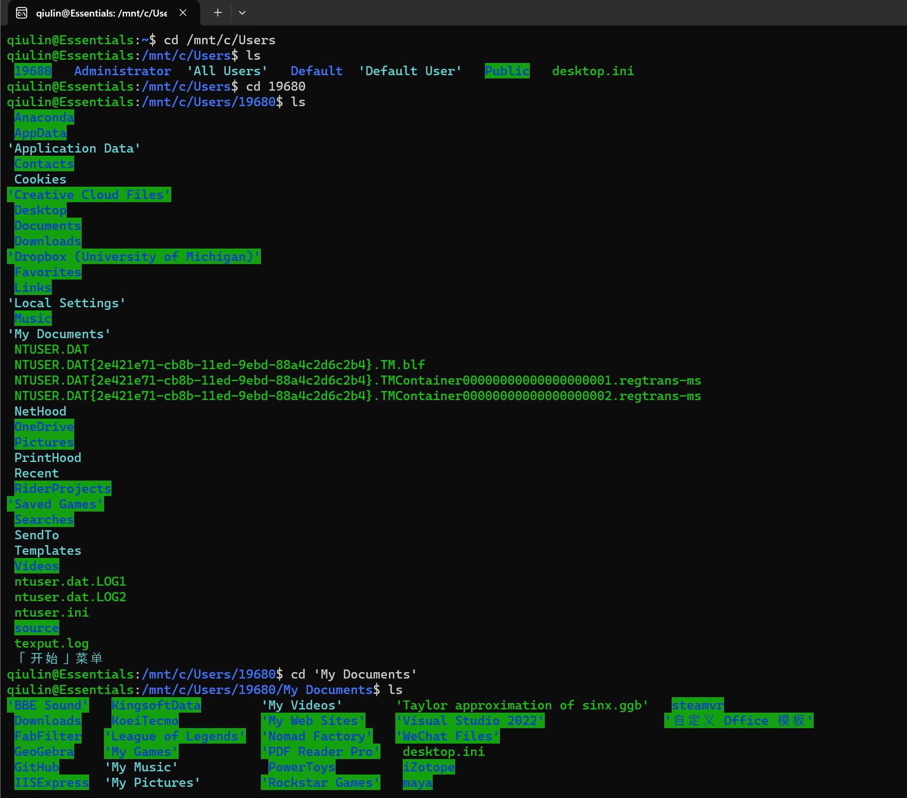
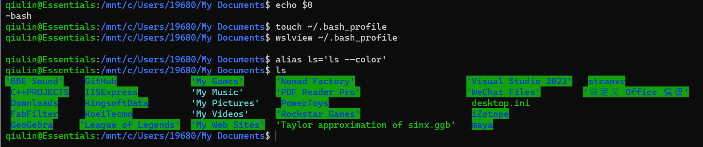
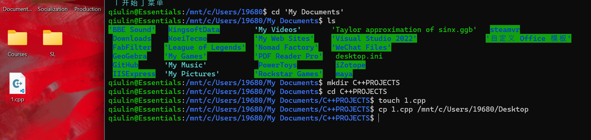
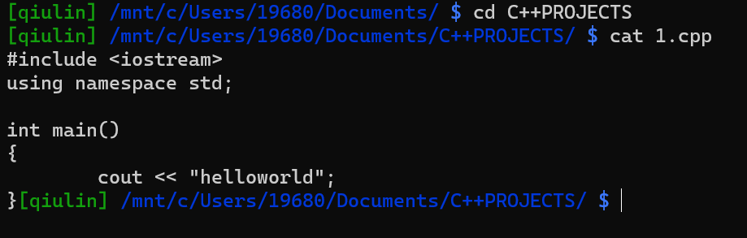
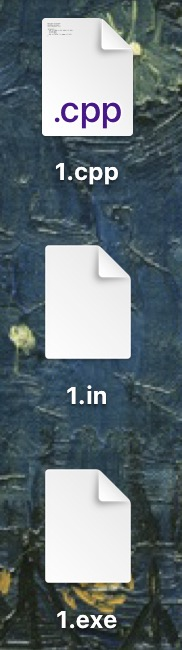
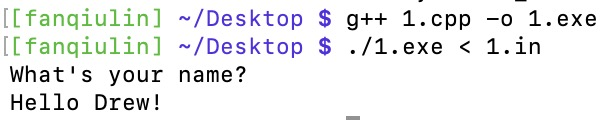
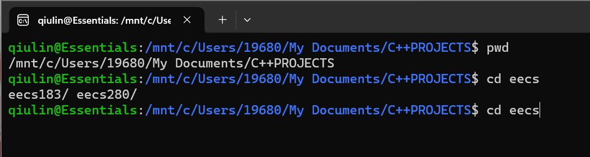
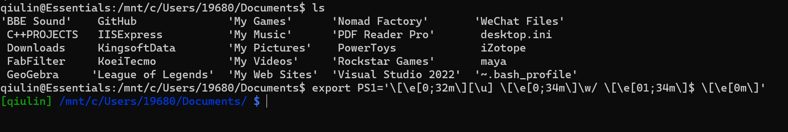

[TOC]

# 1 Command Line Interface (CLI)

The ***GUI* (Graphic User Interface)** is a **“point and click” way** to interact with a computer. The **Windows File Explorer** and **macOS Finder** are examples of GUIs.

The ***CLI* (Command Line Interface)** is a **text-based way** to interact with a computer. 

The terminal is another name for the CLI. 

mac中，CLI就是terminal，terminal就是CLI； Windows Subsystem for Linux (WSL) 中叫做ubantu (没错就是ubantu server的虚拟机版本). 

The CLI is fast, easy to automate, and easy to use remotely.


## **1.1 Mac OS CLI tools Installation**

### 1.1.1 Install compiler

Open the Terminal application which comes with macOS. Install a compiler.

```cmd
xcode-select --install
```

**Notice that this compiler is really Apple LLVM pretending to be `g++`. Your version might be different.**

```cmd
g++ --version
#Configured with: --prefix=/Library/Developer/CommandLineTools/usr --with-gxx-include-dir=/usr/include/c++/4.2.1
# Apple LLVM version 9.0.0 (clang-900.0.38)
# Target: x86_64-apple-darwin16.7.0
#Thread model: posix
# InstalledDir: /Library/Developer/CommandLineTools/usr/bin*/)
```

### 1.1.2 Install Homebrew package manager

```cmd
/bin/bash -c "$(curl -fsSL https://raw.githubusercontent.com/Homebrew/install/master/install.sh)"
```

Homebrew installs to a non-standard location, `/opt/homebrew/`. 

**重要的一步：把homebrew加入环境变量：**

**You’ll need to run the following to add Homebrew to your path:**

```cmd
echo 'eval "$(/opt/homebrew/bin/brew shellenv)"' >> ~/.zprofile
```

Check your install. Your version might be different.

```cmd
brew --version
# 3Homebrew 3.6.14
```

Close your terminal and reopen your terminal.

### 1.1.3 Install CLI tools

Use the Homebrew package manager to install a few command line programs.

```cmd
brew install wget git tree
```

### 1.1.4 Use CLI tools

前面已经说了，macOS所有的CLI就是在terminal中执行. 在terminal中写command时加上各种关键词就能使用各种CLI工具. 

在terminal中输入`zsh`，可以打开**Zshell**, which is typical on macOS.

## **1.2 Windows Subsystem for Linux (WSL) Installation**

The Windows Subsystem for Linux (WSL) runs an **Ubuntu Linux guest virtual machine** on your Windows host machine.

When you see `$` in this tutorial, you should type into your shell the command that comes after the `$`.

你看到`$`就说明在shell里面了

### 1.2.1 Install WSL

打开**PowerShell**并且**run it as administrator**. 

Check if WSL was already installed. 

如果看到这个，WSL is already installed.

```cmd
wsl -l -v
#  NAME      STATE       VERSION
#* Ubuntu    Stopped     2
```

如果看到WSL help text，WSL is not installed.

```cmd
wsl -l -v
# Copyright (c) Microsoft Corporation. All rights reserved.
# Usage: wsl.exe [Argument]
# ...
```

如果没installed，install:

```powershell
wsl --install
```

> **Pitfall:** Make sure Windows Update is enabled and your machine is up-to-date. Settings > Update and Security > Windows Update.
>
> **Pitfall:** If you still get an error from `wsl --install`, try the [Manual installation steps](https://learn.microsoft.com/en-us/windows/wsl/install-manual).
>
> For the Linux distribution, choose the latest version of Ubuntu LTS. At the time of this writing, that’s Ubuntu 22.04 LTS.

安装好之后重启电脑，然后Start PowerShell as administrator, and check that the `VERSION` is 2. 如果显示powershell里输入 `wsl -l -v` 后version显示为1，那么要 `wsl --update`.

### 1.2.2 Start an Ubuntu Bash shell

在搜索栏搜索ubantu并打开. 这个时候你就在运行WSL的linux虚拟机的command line.


### 1.2.3 Install CLI tools

进入WSL的linux虚拟机的command line之后，Use the `apt` package manager to install a few command line programs. **虽然这是虚拟机，但是Linux系统里也是用的同样的 command**.

```shell
sudo apt update
sudo apt install g++ make rsync wget git ssh gdb python3 tree
```

### 1.2.4 Accessing Linux files from Windows

点击Linux的icon. Navigate to your home directory: Linux > Ubuntu > home > 你的用户名.


To open the File Explorer in any directory at the WSL (Ubuntu) Terminal:

### 1.2.5 Accessing Windows files from Linux

To access Windows files from Linux, navigate to `/mnt/c/`.

cd就是change directory，就是更改当前的working directory为该文件夹. 如果不给出absolute path的话就是在当前的working directory进入其中的某个子文件夹.

如果想要打开而不是进入某个文件夹/文件的话就是 `open` 以及 `wslview`. `open` 是MacOS的指令，`wslview` 是wsl的指令.

```cmd
cd /mnt/c/Users
ls
# ...(目录里的各种东西)
cd 19680 #我的用户名
ls 
# ...(目录里的各种目录和文件, 包括Desktop和Documents)
cd 'My Documents'
...
```



### **1.2.6 Pitfalls(需要注意的隐患)**

1. Avoid Spaces in paths

Avoid paths that contain spaces. Spaces causes problems with some command line tools.

| Bad Example        | Good Example |
| ------------------ | ------------ |
| `EECS 280/`        | `eecs280/`   |
| `Project 1 Stats/` | `p1-stats/`  |

2. Project folder in Windows home directory

WSL中Linux（Ubuntu）有一个独立的home directory. 

虽然我们讲了怎么在WSL中ubantu和windows互通文件，但是将代码存储在 Windows 主目录中可能会导致运行速度减慢，因为 WSL 使用network file share（网络文件共享）在 Windows 和 Linux 之间传输文件.

| Bad Example                 | Good Example         |
| --------------------------- | -------------------- |
| `/c/mnt/Users/awdeorio ...` | `/home/awdeorio ...` |

3. Root user

避免在 WSL 中以 root 用户身份进行 everyday coding，因为有些程序在以root用户身份运行时无法正常工作. When you first installed Ubuntu, you should have been prompted to create a Linux username and password.

## **1.3 Basic Commands**

A ***file*** stores data like C++ source code (`main.cpp`) or plain text (`example.txt`).

A ***directory*** contains files and other directories. It’s also called **a folder**. 也就是文件夹

A ***path*** is the location of a file or directory. **Sometimes we end a directory path with `/`.**(有没有不重要) For example:

```
/Users/ohjun/Desktop/project/main.cpp
/Users/ohjun/Desktop/project/stuff/
```

### 1.3.1 `ls`: print files and directories in working directory

`ls` prints files and directories in the present working directory.

```cmd
ls
# example.txt main.cpp stuff
```

### **1.3.1* Pro-tip:** Colorize the output of `ls`  and prompt 定制颜色

#### for Windows/WSL and Linux (Bash shell):

> Verify you’re using the Bash shell, which is typical on WSL Ubuntu Linux.
>
> ```cmd
> echo $0
> # -bash
> 
> touch ~/.bash_profile  
> # Create file if it doesn't exist
> 
> wslview ~/.bash_profile
> alias ls='ls --color'
> ```
>
> 
>
> for macOS (z shell):
>
> ```cmd
> echo $0
> touch ~/.zshrc  # Create file if it doesn't exist
> open ~/.zshrc
> alias ls='ls -G'
> ```
>
> prompt 的颜色也可以 customize
>
> For WSL, 通过 `~/.bash_profile` 打开 bash_profile 文件，然后在文件中输入:
>
> ```shell
> export PS1='\[\e[0;32m\][\u] \[\e[0;34m\]\w/ \[\e[01;34m\]$ \[\e[0m\]'
> ```
>
> For macOS, 通过 `~/.zshrc` 打开 zshrc 文件，然后在文件中输入:
>
> ```shell
> PROMPT='%F{green}[%n] %F{blue}%~%f %B%F{blue}$%f%b '
> ```

### 1.3.2 `tree`: 以树状打印directory架构

`tree` recursively prints files and directories, which ilss useful for comparing your files against a project spec. 打印directory的架构

```cmd
tree
.
├── example.txt
├── main.cpp
└── stuff
    └── hello.txt
```

> 如果新的系统没安装tree，这样安装
>
> ```cmd
> sudo apt install tree  # WSL, Linux
> ```
>
> ```cmd
> brew install tree      # macOS
> ```

### 1.3.3 `pwd`: print working directory

`pwd` 顾名思义也就是print working directory, 打印当前工作目录

```cmd
pwd
# /Users/ohjun/Desktop/project
```

### 1.3.4 `mkdir`: make directory

`mkdir` 在当前的working directory creates a directory. 创造一个空目录(文件夹).

```cmd
mkdir myfolder
```

### 1.3.5 `touch`: create file

`touch` creates an empty file. 创造一个空文件，并给它命名

```cmd
touch euchre.cpp
```

### 1.3.6 `rm`, `rm -rf`: remove

`rm` removes (deletes) a file. 删除文件

`rm -rf` removes a directory. 删除一整个文件夹

```cmd
rm euchre.cpp
rm -rf stuff2/
```

**Files deleted by `rm` are gone forever. You cannot recover them from the Trash. 这和图形化界面里面的删除不一样！没有回收站，删了就是永久删了，一定要谨慎！**

### 1.3.7 `cd`: change directory 更改工作目录

`cd` 顾名思义change directory. 

前面在Accessing Windows files from Linux中已经讲过了，如果不给出absolute path的话就是在当前的working directory进入其中的某个子文件夹.

```cmd
cd /mnt/c/Users
ls
# ...(目录里的各种东西)
cd 19680 #我的用户名
ls 
# ...(目录里的各种目录和文件, 包括Desktop和Documents)
cd 'My Documents'
...
```

### 1.3.8 `cp`: copy and paste a file

`cp` copies a file. 复制当前working directory中的一个文件到别的地方

```cmd
cp 1.cpp /mnt/c/Users/19680/Desktop #也可以用../..等等表示parent directiry，不用重新打一遍之前的目录
```



### 1.3.9 `open` / `wslview`: Mac/Wsl打开文件

前面Accessing Windows files from Linux写过了, macOS 中用 `open` 来opens a file or directory with the default application; WSL (Windows)中用 `wslview` 来opens a file or directory with the default application.

如果没下载这个指令，还要下载才能用.

eg:

```cmd
wslview 1.cpp
```

### 1.3.10 `wget`: 下载来自Internet的文件

`wget` downloads a file from the internet.

For example:

```cmd
wget https://eecs280staff.github.io/p1-stats/starter-files.tar.gz
ls
# starter-files.tar.gz
```

### 1.3.11 `tar`: 解压压缩包

`tar` unpacks an archive. 也就是解压一个压缩包.

For example, unpack the starter files for EECS 280 project 1:

```cmd
tar -xvzf starter-files.tar.gz
# starter-files/
# ...
tree
#.
├── starter-files
│   ├── Makefile
│   ├── main_test.in
│   ├── main_test.out.correct
│   ├── main_test_data.tsv
│   ├── p1_library.cpp
│   ├── p1_library.hpp
│   ├── stats.hpp
│   ├── stats_public_test.cpp
│   └── stats_tests.cpp.starter
└── starter-files.tar.gz
```

### 1.3.12 `diff`: 比较文件

`diff` compares two files. 如果没有output说明这两个file一模一样（除了名字）.

比如下面就是比较 `main_test.out` 和 `main_test.out.correct` 这两个文件，结果一模一样，于是没有输出.

```cmd
diff main_test.out main_test.out.correct
```

### 1.3.13 `cat`: 打印文件内容

`cat` concatenates(串联) files and prints them.

也就是你cat几个file就会串联地输出这几个file的内容.

For example, 随便在 `1.cpp` 里面写点东西

```cmd
cat 1.cpp
```



### 1.3.14 `grep`: 在(多个)file中搜索

`grep`， 顾名思义，就是“*g*lobally search for a *re*gular expression and *p*rint matching lines”.（这个好像不太顾名思义，）

```cmd
grep vector main.cpp
# #include <vector>
# 		vector<double> v = extract_column(filename, column_name);
#		  vector<vector<double> > summary = summarize(v);
```

再比如更加高级：Search for `vector` in 当前working directory，也就是这个项目中所有的 `.cpp` files. terminal会自动告诉你哪行是在哪个 `.cpp` 文件，因而非常好用.

```cmd
grep vector *.cpp
# main.cpp:#include <vector>
# main.cpp:  vector<double> v = extract_column(filename, column_name);
# main.cpp:  vector<vector<double> > summary = summarize(v);
# stats.cpp:#include <vector>
# ...
# stats_tests.cpp:#include <vector>
# ...
```

## **1.4 File, Directory, Path**

### 1.4.1 Current directory `.`

`.` refers to the current directory.

打开current directory的方法:

macOS:

```shell
open .
```

Windows/WSL: 

```shell
wslview .
```

### 1.4.2 Absolute & Relative Path(绝对&相对路径)

An *absolute path* starts from the root directory `/`.

> Eg:
>
> ```cmd
> /usr/local/bin/python3
> /usr/bin/python3
> ```

A *relative path* starts from the current directory.

> Eg:
>
> ```cmd
> ./main.exe
> ```

### 1.4.3 Parent directory `..`

父目录：原目录的上一级目录

`..` refers to the parent directory of the current directory.

```cmd
pwd
# /Users/ohjun/Desktop/project/stuff
cd ..
pwd
# /Users/ohjun/Desktop/project
```

### 1.4.4 Home directory `~`

`~` refers to your home directory.

```cmd
cd ~
pwd
# /Users/ohjun
ls
# Applications Pictures Desktop ...
```

### 1.4.5 Root directory `/`

`/` refers to the root directory. This is the top-most directory in your file system, and has no parent. 根目录是文件系统中最顶层的目录，它没有父目录.

```cmd
ls /
# Applications cores sbin ...
```

### 1.4.6 Glob `*`

A *glob* is a wildcard path that may match multiple paths. The `*` symbol matches any string.

可以联想一下python里面的 `import 什么什么.*`，就是import这个包里所有东西.

下面就是一个示范，把starter_files这个directory里面所有东西都copy and paste到当前的working directory中.

```cmd
cp -v starter_files/* .
# './Makefile'
# './main_test.in'
# ...
```

## **1.5 Redirection**

### 1.5.1 Pipe `|`: 

The *pipe* (`|`) sends the output of the left command to the input of the right command.

把左边命令的输出放进右边命令的输入，然后执行右边命令.

看着有点绕. Here’s an example that searches for `.cpp` files. The output of `ls` is piped to the input of `grep`. 这里是把 `ls` 也就是打印 working directory 中所有文件的结果弄成一个临时文件让grep查查里面有几个 `.cpp`, 巧妙地查询了当前 directory中 cpp 文件的数量.

```cmd
$ ls | grep cpp
main.cpp
stats.cpp
stats_tests.cpp
```

### 1.5.2 Input redirection `<`: 用文件作为程序输入

*Input redirection* sends the contents of a file to the input of a program.

Input redirection is useful for automating program input. 这是程序自动化的重要内容.

**非常逆天的一件事情是C++中我们知道 `<<` 是outstream的方向，`>>` 是instream的方向. 而terminal里面是反的，`<`才是input，`>` 才是output. **可能因为unix系统诞生的时候C++还远没有出现.

Here’s an example program.

```c++
#include <iostream>
#include <string>
using namespace std;

int main() {
  cout << "What's your name?" << endl;
  string name;
  cin >> name;
  cout << "Hello " << name << "!\n";
}
```

我们可以直接在terminal里面用编译器来跑程序，创建一个exe文件来跑程序，用terminal作为输入和输出流的工具:

```cmd
g++ main.cpp -o main.exe
./main.exe
# What's your name?
# Drew (input)
# Hello Drew!
```

Create a file with user input. We’ll call it `main_test.in`.

```tex
Drew
```

Redirect file `main_test.in` to stdin of `main.exe`. We have automated user input.

```cmd
g++ main.cpp -o main.exe
./main.exe < main_test.in
# What's your name?
# Hello Drew!
```

这就十分甚至九分好用，尤其是不在开发大项目而是写一个小程序的时候，IDE太冗余而且臃肿了，这时候就可以展现一下高超的linux素养（迫真！

下面是一段笔者的展示:






### 1.5.3 Output redirection `>`: 储存程序的输出

继续刚才的程序. 现在我们用 `>` 来把程序的输出放进一个文件. **区别不同的是这里不用再创建 `1.out` 这个文件，terminal会自动帮我们创建.**

- `./main.exe` runs the program
- `< main_test.in` redirects `main_test.in` to stdin
- `> main_test.out` redirects stdout to `main_test.out`

```cmd
./main.exe < main_test.in > main_test.out
```

这个时候可以再加点debug！我们可以在working directory创建一个叫做 `main_test.out.correct` 的文件，然后在里面写预期的结果. 然后我们用 `diff` 来检查它和 `main_test.out` 的出入，看看是否一致，以此来debug. 

## **1.6 Useful Tips**

### 1.6.1 `clear`: clear the terminal

清理terminal/ubantu，不显示刚才写的东西. 但是并不会改变working directory.

也有快捷键，是Control + L.

### 1.6.2 Tab complete 

按一次tab自动补全可能的directory，按两次tab显示可选选项.

比如这个C++PROJECTS中有两个子文件夹eecs183和eecs280，输入 `cd e`之后按一次tab会帮你补全成 `cd eecs` , 再按一次会显示你有eecs183和eecs280两个选项.



### 1.6.3 ↑和↓ 

按 ↑ 会预输入你上一个command，也就是说问你要不要重复上个步骤. 

按几次 ↑ 就是上几个，同样在过程中按 ↓ 就是这个的下一个command. 

好处是如果连续输入多个类似command，可以用上下键来减少打字量. 如果是长命令就更加适合.

### 1.6.4 Customize prompt: prompt改颜色

At this point, you should know whether you are using **Bash** or **Z Shell**, and you should have a working `.bash_profile` or `.zshrc` file.

> (1) 如果是mac的zshell:

首先输入zsh打开zshell, 然后如果没创建过 `.zshrc` 文件的话，就输入 `touch ~/.zshrc` 在home directory创建一个叫  `.zshrc` 的文件，zshell会自动识别它. 

而后输入这一行命令

```cmd
PROMPT='%F{green}[%n] %F{blue}%~%f %B%F{blue}$%f%b '
```

就会更改一些关键词的颜色更加容易识别. 也可以了解一下增加更多的自定义.


> (2) 如果是wsl的bash shell:

首先打开ubantu, 然后如果没创建过 `.bash_profile` 文件的话输入 `touch ~/.bash_profile` 在home directory创建一个，bash shell 会自动识别它. 

而后输入这一行命令

```cmd
export PS1='\[\e[0;32m\][\u] \[\e[0;34m\]\w/ \[\e[01;34m\]$ \[\e[0m\]'
```

和mac差不多，就是改了一些关键词.



## **1.7 Shell Scripting(脚本)**

In this tutorial, you’ll learn to **automate command line tasks** using a shell script. Each line of code in a shell script is a command that could be entered at the command line.

下面我们用一个例子来介绍.

`wc` 是一个用来计数的command, `-l` 表示line，行数. `wc -l file1`将返回'file1'中的行数.

现在我们来写一些command用以统计the number of files and directories in the present working directory.

```cmd
ls
# bin  hello  hello_css  html  insta485  insta485generator  pyproject.toml  tests
echo "Count of files and folders:"
# Count of files and folders:
ls | wc -l
# 8
```

### 1.7.1 Creating a shell script

现在我们不一行一行打了. 我们创建一个text file called `lscount` and add the following contents. **Notice that shell scripts may omit a file extension. shell scripts的后缀名名会被忽略，并不重要.**

```cmd
#!/bin/bash
#
# lscount
#
# List files and folders, followed by a count

# Stop on errors, print commands
# See https://vaneyckt.io/posts/safer_bash_scripts_with_set_euxo_pipefail/
set -Eeuo pipefail
set -x

# List
ls

# Count
echo "Count of files and folders:"
ls | wc -l
```

### 1.7.2 Adding an executable bit

**We can’t yet execute the script because the *executable bit* is not yet set. The `rw` means “Read Write”. **

那么怎么设置可执行的权限呢？我们在运行script之前写上 `chmod +x` 加上script的名字就可以. 这样就把 `rw` 只读改成`rwx` : “Read Write Execute”. 

````cmd
chmod +x lscount
````

那么怎么检测有没有设置成功呢？我们使用 `ls -l` 指令.

```cmd
ls -l lscount
```

output是这个 `-rw` 说明权限还是只读.

```cmd
# -rw-rw-r-- 1 awdeorio staff 273 Aug 27 10:15 lscount
```

是下面这个 `-rwx` 说明权限改好了.

```cmd
# -rwxrwxr-x 1 awdeorio staff 273 Aug 27 10:15 lscount
```

最后在当前working directory运行script.

```cmd
./lscount
```

下面是笔者的一个示例.


### 1.7.3 注意事项

1. Shebang

Scripts need a special first line, called a [shebang](https://en.wikipedia.org/wiki/Shebang_(Unix)). Make sure you didn’t forget it.

```cmd
head -n1 bin/lscount
!/bin/bash
```

2. Stop on errors

**默认情况下，shell 脚本error时不会stop。每个bash shell 脚本的第一行代码都应该写上下面这个东西**. [Here’s why](https://vaneyckt.io/posts/safer_bash_scripts_with_set_euxo_pipefail/).

```cmd
set -Eeuo pipefail
```

3. Lines Endings

Scripts need to have UNIX line endings to work properly. Windows `CRLF line terminators` are a problem.

```cmd
./bin/lscount
# -bash: ./bin/lscount: /bin/bash^M: bad interpreter: No such file or directory
file ./bin/lscount
# bin/lscount: Bourne-Again shell script text executable, ASCII text, with CRLF line terminators
```

Change Windows line endings to UNIX line endings. 以下三个方法都可以.**You might have to install the `dos2unix` package.**

```cmd
dos2unix bin/lscount
```

```cmd
fromdos bin/lscount
```

```cmd
sed -ri 's/\r$//' bin/lscount
```

This is what a correct script file type looks like:

```cmd
file bin/lscount
# bin/lscount: Bourne-Again shell script text executable, ASCII text
```
