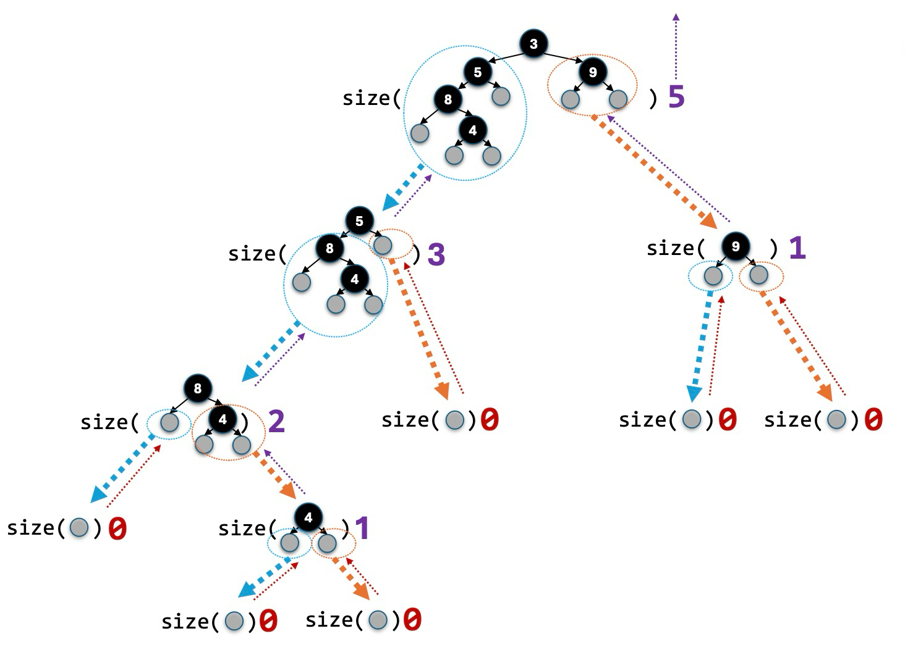

[TOC]

# 24 Recursion

一个 **Recursive definition 或称 Mathematical function 或称 Computer function** 指的是一个 refers to itself 的 definition.

更加 precisely 地说，recursion 是一种 repetition through self-reference.

Recursion 分为两部分：**Base case** 和 **Recursive step.** 记得在 eecs 203 上说过：**Recursion 就是 Mathematical Induction.**

```c++
void annoyingSong(int numBottles) {
  if (numBottles == 0) {
    cout << "That's all folks!" << endl;
  } else {
    cout << numBottles << " bottles of beer on the wall." << endl;
  }
  
  annoyingSong(numBottles - 1);
  // a(n) = a(n-1)
}
```

再比如：factorial
$$
n! = \begin{cases} n\cdot (n-1)!\;, \;n > 0 \\ 1\;,\;n = 0\end{cases}
$$

```c++
int factorial(int n) {
	if (n == 0) return 1;
	else return n * factorial(n-1);
}
```

因而 factorial(4) 的 function call 的流程就是如下的：


## 24.1 如何写 Recursion

> Step 1: 定义 Base Case

1. Base case 是情况最简单时（edge）function 的返回值

2. Base case 必须充分考虑，defined properly. 通常是 0/1 的时候。

3. 有时候我们需要 multiple base cases!!（如203学过的）

> Step 2: approch the base case

我们写的 inductive step 必须要 take us closer to the base case: 每次给出一个 step 的 answer 之后，problem size 必须减小。

> Step 3: handle the one-step-smaller answer

假设我们已经取得了一个 solution to the problem that is one step smaller，我们应当如何把它放进 recursive call 中，以最后获取 main problem 的答案？（实际上就是：假设 inductive hypothesis 成立，那么如何前往下一步）

### 24.1.1 Some examples

1. exponential
   $$
   a^n = \begin{cases} a\cdot a^{n-1}\;, \;n > 0 \\ 1\;,\;n = 0\end{cases}
   $$

   ```c++
   int power(int a, int n) {
   	if (n == 0)
       return 1;
     else
       return a * power(a, n-1);
   }
   ```

2. countdown

   ```c++
   void countdown(int n) {
   	if (n == 0)
   		cout << n << endl;
     else {
       cout << n << endl;
       countdown(n-1);	// countdown from n-1 to 0
     }
   }
   
   // 第二种写法
   void countdown(int n) {
     cout << n << endl;
     if (n > 0)
       coutdown(n-1);
   }
   ```

3. sum

   ```c++
   // 正确版本
   int sum(int n) {
     if (n==0)
       return 0;
     else
       return n + sum(n-1);
   }
   
   // wrong 1:
   int sum(int n) {
     if (n==1)		// wrong: 没有 handle n==0
       return 1;
     else
       return n + sum(n-1);
   }
   
   // wrong 2:
   int sum(int n) {
     if (n==0)
       return 0;
     else
       return n + (n-1) + sum(n-2);	// 只对 even n 有效果
   }
   
   // wrong 3:
   int sum(int n) {
     if (n==0)
       return 0;
     else
       return sum(n);	// 没有 approach base case
   }
   
   // wrong 4:
   int sum(int n) {
     int total = 0;
     if (n==0)
       return total;
     else {
       total += n;
       sum(n-1);	// 没有把 inductive hypothesis 成立的结果传到 next problem 中
       return total;
     }
   }
   
   // wrong 5:
   int sum(int n) {
     if (n==0)
       return 0;
     else
       return n + sum(n--); // wrong: n--是先 evaluate再--的, 会把n传进去再--(此时已经没用了), 于是死循环
   }
   ```

### 24.1.2 ex2: 通过 recursion 查看 `t` 是否在 array 里

这里有很多种写法

```c++
// 1. yes!
bool contains(int* begin, int* end, int t) {
  if (begin == end)
    return false;
  else 
    return (*begin == t) || contains(begin + 1, end, t);
}

// 2. yes!
bool contains(int* begin, int* end, int t) {
  if (begin == end)
    return false;
  else if (*begin == t)
    return true;
  else
    return contans(begin+1, end, t);
}

// 3. yes!
bool contains(int* begin, int* end, int t) {
  return (begin != end) && ((*begin == t) || contains(begin+1, end, t));
}

// 4. yes!
bool contains(int* begin, int* end, int t) {
	if (begin == end)
    return false;
  else
    return (*(end-1) == t) || contains(begin, end-1, t);
}

// 5. yes!	从两边查看
bool contains(int* begin, int* end, int t) {
  if (begin >= end)
    return false;
  else {
    return (*begin == t) || (*(end-1) == t) || contains(begin+1, end-1, t);
  }
}
```

### 24.1.3 ex3: 判断 palindrome(回文数)

```c++
bool isPalindrome(string s) {
	if (s.size() < 2)	// 如果recur到size==1, 说明是回文数
    return true;
  else
    return s[0]==s[s.size()-1] && isPalindrome(s.substr(1, s.size()-2));	// 去除头尾的子str
}
```

### 24.1.4 ex4: 倒转 array

```c++
void swap(int* x, int* y) {
  int temp = *x;
  *x = *y;
  *y = temp;
}

void revHelp(int* left, int* right) {
	if (left >= right)
    return;
  else {
		revHelp(left+1, right-1);	// rev去除头尾的subarray
    swap(left, right);	// swap 头尾
  }
}

void reverseArray(int* a, int size) {
  revHelp(a, a+size-1)
}
```

### 24.1.5 Towers of Hanoi 汉诺塔


实际上：汉诺塔的整个流程可以分为这三步：

对于 n 层塔

1. 先把 n-1 个东西从 A 中移动到 B
2. 把腾出来的第 n 个东西从 A 中移动到 C
3. 把 B 里面的 n-1 个东西移动到 C

然后就结束了。


而加入这三步其中的 recursion，详细的步骤是：

1. 先把 n-1 个东西从 A 中移动到 B

   1.1 先把 n-2 个东西从 A 中移动到 C

   ​	...

   1.2 再把腾出来的第 n-1 个东西从 A 中移动到 B

   1.3 把 C 中的 n-2 的东西移动到 B

   ​	...

2. 把腾出来的第 n 个东西从 A 中移动到 C

3. 把 B 里面的 n-1 个东西移动到 C

   3.1 先把 n-2 个东西从 B 中移动到 A

   ​        ...

   3.2 再把腾出来的第 n-1 个东西从 B 中移动到 C

   3.3 把 A 中的 n-2 个东西移动到 C

   ​        ...

因而每次递归分为两个大移动 $T(n-1)$ 和一个小移动 $T(1)$。递推公式为 $T(n) = 2T(n-1) + 1$。


我们推一遍 $n=1,2,3$ 时的全过程：

最简单的是：

n=1，没有 $T(n-1)$，直接把 n 从source 移动到 dest.

然后是：

n=2，先把 1 个移动到 temp ($T(1)$)，再把下面一个移动到 dest ($T(1)$)，然后把 temp 上的移动到 dest ($T(1)$).

n=3，先把上面两个按照 n=2 的方法移动到 temp ($T(2)$)，再把下面一个移动到 dest ($T(1)$)，然后把 temp 上的移动到 dest ($T(2)$).

..

n=k，先把上面两个按照 n=2 的方法移动到 temp ($T(k-1)$)，再把下面一个移动到 dest ($T(1)$)，然后把 temp 上的移动到 dest ($T(k-1)$).

（我们可以发现一点：在 $n-1$ 到 $n-2$ 的 recursion 过程中：如果我们要把 $[n-1]$ 片 **从 source 移动到 temp** 上时，我们就要先把 $[n-2]$ 片 从 **source 移动到 dest**，然后把第 $n-1$ 片从 **source 移动到 temp** 上，然后再把 $[n-2]$ 片从 **dest** 移动到 **temp** 上。这说明：我们从上一层递归到下一层递归时，**我们的三个 subquestion 中的三个柱子是要换位置的。** 但是这个问题我们并不关心，因为 recursion 的结构已经自动包含了换位的行为了。）

因而我们的代码结构是：

```c++
void move(int n, string source, string dest, string temp) {
  if(n==1)
    cout << "Move from " << source << " to " << dest << endl;	// n==1 说明已经结束了
 	else {
    move(n-1, source, temp, dest);
    move(1, source, dest, temp);
    move(n-1, temp, dest, source);
  }
}

void printHanoi(int n) {
  move(n, "A", "C", "B");
}
```

以下为笔者搬汉诺塔截的关键步骤（显示了换位）


## 24.2 Tail Recursion: 获得 Constant Space Cost

### 24.2.1 Space Cost of Iteration && Recursion

我们看一个既可以用 iteration 又可以用 recursion 写的函数:

```c++
void revHelp(int *left, int *right) {
	while (left < right) {
    swap(left, right);
    ++left;
    --right;
  }
}
```

这个函数的 time complexity 是 ${n\over 2} \in O(n)$, 而 space cost 是 $1 \in O(1)$.

而我们用刚才的 recursion 来写的话：

```c++
void revHelp(int* left, int* right) {
	if (left >= right)
    return;
  else {
		revHelp(left+1, right-1);	// rev去除头尾的subarray
    swap(left, right);	// swap 头尾
  }
}
```

这个函数的 time complexity 也是 ${n\over 2} \in O(n)$, 但是 space cost 也是 ${n\over2} \in O(n)$.

因为我们会 recursively build $n\over 2$ 个 stack frame，并从后至前进行 swap，swap 完一个之后就消除一个 stack frame，最后消除完最开始建立起的第一个 stack frame 结束 function call.

但是如果我们这样写：

```c++
void revHelp(int* left, int* right) {
	if (left >= right)
    return;
  else {
    swap(left, right);
		revHelp(left+1, right-1);
  }
}
```

只是把后面两行换掉，我们就得到了 $1 \in O(1)$ 的 constant 的 space cost. 因为当我们把 recursive call 放在整个函数的最后一步来 return 时，我们就在 recursive call 之后把原本的 stack frame 消除了，并立刻在原位置建立起了新的 stack frame。因而，整个 function call 的过程中我们一直保持只使用一个 stack frame 的 memory，极大地减小了 space cost.

这种 Recursion 就叫做 **Tail Recursion**: 在函数的最后一步进行 Recursive Call，从而从始至终只使用一个 stack frame.

### 24.2.2 Accumulator-Passing Style: 重写 Factorial 为 Tail Recursion

我们看到原本写的 Factorial 函数：

```c++
int factorial (int n) {
	if (n==0)
    return 1;
  else
    return n * factorial(n-1);
}
```

这看起来是一个 Tail Recursion

但是不是！

因为我们 recursively call `factorial(n-1)` 的时候，我们外面还有一个 `n *`，这就导致前一个 stack frame 还没有结束，我们就先引入了后一个 stack frame. 

最后一个 function 会先 call 出所有的 $n$ 个 recursive stack frame 再一个一个运行并从后往前退出，因而 time complexity = $n \in O(n)$.

但是这个问题很好解决

我们通过把前一个 $n$ 的值放进 parameters 里来把它改成 tail recursion：

```c++
int factHelp(Int n, int prodSoFar) {
  if (n == 0)
    return prodSoFar;
  else
    return factHelp(n - 1, n * prodSoFar)
}

int factorial(int start) {
  return factHelp(start, 1);
}
```


这个 `factorial` 函数的 space cost 为 $1 \in O(1)$.

它对应的 iterative solution 为：

```c++
int factIter(int start) {
  int n = start;
  int prodSoFar = 1;
  
  while(true) {
		if (n==0)
      return prodSoFar;
    prodSoFar = n * prodSoFar;
    n = n-1;
  }
}
```

这种 revise 一个 non-tail recursion 为一个 tail recursion 的方式叫做 **Accumulator-passing style(APS).**

## 24.3 Structural Recursion

### 24.3.1 Recursion in Linked List

#### 24.3.1.1 recursively 理解 linked list 的结构

我们可以认为一个 list 是 either:

1. empty

or

2. 一个 datum 和一个 sublist


#### 24.3.1.2 recursively processing a linked list

计算所有元素的 sum:

```c++
int sum(Node* n) {
  if (n == nullptr)
  	return 0;
  else
  	return n->datum + sum(n->next);
}
```

返回最后一个元素：

```c++
int lasr(Node *n) {
	if (n->next == nullptr)
    return n->datum;
  else
    return last(n->next);
}
```

获取值为 val 的元素个数：

```c++
int count(Node* n, int val) {
  if (n == nullptr)
    return 0;
  else {
    int countInRest = count(n->next, val);
    if (n->datum == val)
      return 1+countInRest;
    else
      return countInRest;
  }
}

另一种写法:
int count(Node* n, int val) {
	return (n->datum==val) + count(n->next, val);
}
```

获取最大值

```c++
int max(Node* n) {
	if (n->next == nullptr)
    return n->datum;
  else {
    int maxInRest = max(n->next);
    // 用i和[1,i-1]中的max相比, 得到[1,i]中的max
    if (n->datum > maxInRest)
      return n->datum;
    else
      return maxInRest;
  }
}
```

### 24.3.2 另一种 ADT: tree

我们这里讲的 tree 局限于 binary tree.

类似于对 Linked list 的 Recursive definition，我们这样 define binay tree:

一个 binary tree 为 either:

1. empty

or:

2. 一个 datum with left and right sub-trees.


一个 tree 有两种 measure 方式：

1. by **size**：tree 中 elements 的个数
2. by **height**: 即 **maximum depth**，the longest chain of nodes from root to leaf.


#### 24.3.2.1 Tree 的 Data Representation

一个 tree 的基本单位是 Node:

```c++
struct Node {
	int datum;
  Node *left;
  Node *right;
}
```


#### 24.3.2.2 计算 Tree 的 `size`

```c++
int size(Node *node) {
	if (node == nullptr)
    return 0;
  else
    return 1 + size(node->left) + size(node->right);
}
```



#### 24.3.2.3 计算 Tree 的 `height`

```c++
int height(Node *r) {
  if (r == nullptr)
    return 0;
  else
    return 1 + max(height(r->left), height(r->right))
}
```

#### 24.3.2.4 计算 Tree 的所有元素和

```c++
int sum(Node* r) {
  if (r==nullptr)
    return 0;
  else
    return r->datum + sum(r->left) + sum(r->right)
    // 本datum和左右subtree的sum的和
}
```

#### 24.3.2.5 计算 Leaves 的数量

```c++
int numLeaves(Node* r) {
  if (r == nullptr)	
    // 说明这个 Node 是空的, 不是 leaf
    return 0;
  else if ((r->left == nullptr) && (r->right = nullptr))	
    // 说明这个 Node 没有 subtree 了, 因而自身是单个 leaf
    return 1;
  else
    // 说明这个 Node 还有 subtree, 因而是左右 subtree 中的 leaves 总数
    return numLeaveds(r->left) + numLeaves(r->right);
}
```

#### 24.3.2.6 查看 tree 中是否有值为 val 的元素

```c++
bool contains(Node *r, int val) {
  if (r == nullptr)
    // 搜索到底了还没有, 返回 false
    return false;
  else
    return (r->datum == val) || contains(r->left, val) || contains(r->right, val);
  	// 自己是 or 左右subtree里有
}
```

#### 24.3.2.7 Traverse 一个 tree

有三种 common tree traversals:

1. Pre-order(前序遍历): 先 visit curent node 再 visit 其 children
2. in-order(中序遍历): visit current node between visit 其 children
3. Post-order(后序遍历): 先 visit 其 children 再 visit current node

##### 24.3.2.7.1 pre-order traversal

```c++
void preOrder(Node* root) {
  if (root != nullptr) {
    // here: process root
    preOrder(root->left);
    preOrder(root->right);
  }
}
```


##### 24.3.2.7.2 In-order traversal

```c++
void inOrder(Node* root) {
  if (root != nullptr) {
    inOrder(root->left);
    // here: process root
    inOrder(root->right);
  }
}
```


##### 24.3.2.7.3 Post-order traversal

```c++
void postOrder(Node* root) {
  if (root != nullptr) {
    postOrder(root->left);
    postOrder(root->right);
    // here: process root
  }
}
```


#### 24.3.2.8 Recursion 的类型

一个 recursive  function 是

1. **linear recursive** 的：if it 每次至多 makes one recursive call 

   例子: factorial, list max

2. **tail recursive** 的： if 它是 linear recursive 的，并且它的 recursion call 是 tail recursion.

3. **tree recursive** 的：if 它可能会 make more than 1 recursive call.

   例子: tree size, height

下面是一个典型的 tree recursive 的 function：Fibonacci Sequence.

```c++
int fib(int n) {
	if (n <= 1)
		return n;
  else
    return fib(n-1) + fib(n-2);
}
```

$$
F(n) = \begin{cases} 0\;,\; n=0\\ 1\;, \;n =1 \\ F(n-1) + F(n-2)\;,\;n > 1\end{cases}
$$


tree recursive 的就是过程图是 tree 的 recursion；linear recursive 的就是过程图是一根线的 recursion.
