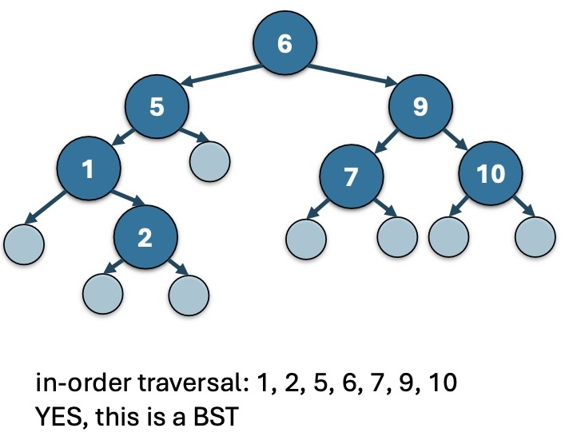
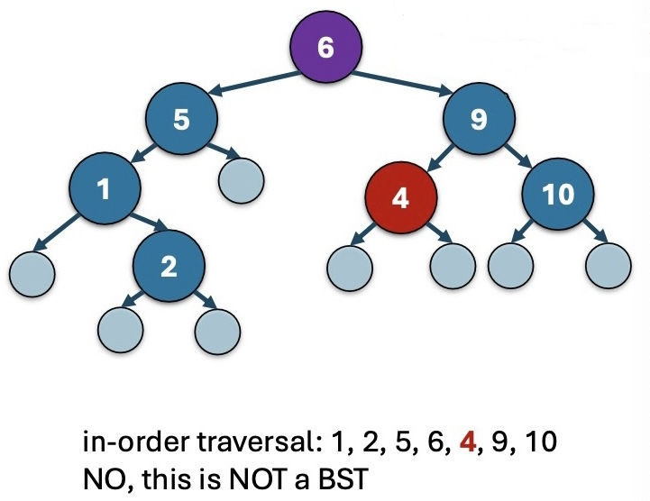

[TOC]

# 25 Binary Search Tree

## 25.1 BST 的定义及如何检测一个 tree 是否是 BST

### 25.1.1 Def of BST

回顾：

> 我们 recursively 定义了一个 binary tree 是 either：
>
> 1. empty 的
>
> Or:
>
> 2. 一个 root datum + 左右两个 binary tree as subtree

现在我们 recursively 定义 **Binary Search Tree**:

> 一棵 binary tree 是一棵 binary search tree, 如果它是 either：
>
> 1. Empty 的
>
> Or:
>
> 2. 满足以下条件：
>
>    (1) Left subtree 中所有 Elements 都比 root datum 小
>
>    (2) Right subtree 中所有 elements 都比 root  datum 大
>
>    (3) Left subtree 和 Right


### 25.1.2 Thm1: 如何 check 一棵 tree 是否是 BST

> Thm: 一颗 tree 为一棵 Binary Search Tree，**当且仅当**它的 in-order traversal(中序遍历) 是 increasing order 的。






## 25.2 BST methods

### 25.2.1 BST max

By Thm 1，容易证明，BST 中最大的元素就是最右边的元素。

因而 BST.max 函数就是返回最右边的 datum.

也就是从整个 BST 的 root 开始，recursively 转到右子树的 root，直到右子树的 root 为 nullptr，说明这里是最右边的元素。

```c++
// REQUIRES: 'node' must be a binary search tree that
// is not empty (i.e. 'node' is not null)
// EFFECTS: Returns the largest element in the tree.
int max(Node *node) {
  if (node->right == nullptr)
  	return node->datum;
  else
  	return max(node->right);
}
```

### 25.2.2 BST contains

By Thm1，

如果 item 比现在的 Node 上的 datum 小，那么应该往左搜；

如果 item 比现在的 Node 上的 datum 大，那么应该往右搜；

找到就 return；

如果这样找最后发现应该找的方向上的下个 Node 已经是空的了，那么说明 BST 里面并没有我们要找的元素，则返回 false.

```c++
// REQUIRES: 'node' must be a binary search tree
// EFFECTS: Returns whether or not the tree contains
the given item.
bool contains(Node *node, int item) {
  if (node == nullptr)
  	return false;
  else if (item == node->datum)
  	return true;
  else if (item < node->datum)
  	return contains(node->left, item);
  else
  	return contains(node->right, item);
}
```

### 25.2.3 提一嘴: `std::less<T>` 

通过 

```c++
#include <functional>
```

我们可以使用一个 std library 中的官方 functor: `less`.

> 回顾：functor 是一种 class，通过 overload `operator()` 使其 object 可以起到函数一样的作用。

我们可以通过建立 `less<Person>` 的 instance 来建立起比较 Person 的 functor object. 它使用的是我们在 `Person` 中 overload 的 `operator<` （我们必须要先自己 overload 才能用）

（那么既然我们已经 overload 了 `operator<` 了为什么我们还需要这个多此一举的 comparator 呢？大概是为了代码可读性，因为我们可能要在同一个 Container 里比较不同类的 members。）

```c++
class Person {
private:
  string name;
  int age;
public:
  Person(string name_in, int age_in)
  	: name(name_in), age(age_in) { }
	bool operator<(const Person & other) const {
		return this->name < other.name;
	}
};


int main() {
  int x = 5;
  int y = 6;
  // 建立一个 less<int> 类的 int comparator
  less<int> intComparator;
  // 下面两个结果是一样的
  cout << intComparator(x, y);
  cout << (x < y);
  
  Person p1("Alice", 20);
  Person p2("Bob", 18);
  // 建立一个 less<Person> 类的 Person comparator
  less<Person> personComparator;
  // 下面两个结果是一样的
  cout << personComparator(p1, p2);
  cout << (p1 < p2);
  return 0;
}
```

### 25.2.4 BST interface

现在我们已经有了所有的 preliminary，我们可以开始构建 BST 的 interface.

注意到，我们这里写的 BST 写了两个 template parameter，但是实际上只有一个。第一个是 Container 里的数据类型 `T`，另一个是它的 Comparator `std::less<T>`.，但是后面的  `std::less<T>` 也是取决于第一个参数 `T` 的，因而只有 T 起到作用。

这里写两个 parameter 的作用是直接把第二个定义为 `Compare = std::less<T>`，于是增加了代码可读性：在 implementation 中不需要 declare 形如 `std::less<T> less` 而是直接使用 `Compare less;`  这种形式来 declare 一个 Comparator object.

并且，通过这样的类似宏的定义，我们 declare 一个 BST object 并不需要写形如 `BinarySearchTree<something, std::less<something>> tree;` 这样子的形式，而是不论 Container 里面的数据是什么类型，使用 `BinarySearchTree<something, Compare> tree;` 这种形式就可以 

```c++
template <typename T, typename Compare=std::less<T> >
class BinarySearchTree {
public:
  BinarySearchTree();
  
  // 以下为 Big Three
  BinarySearchTree(const BinarySearchTree &other);
  BinarySearchTree & operator=(const BinarySearchTree &other);
  ~BinarySearchTree();
  
  // 以下为 4 个 usage functions
  bool empty() const;
  int size() const;
  bool contains(const T &item) const;
  void insert(const T &item);
  
private:
  // 1. Node 结构
  struct Node {
    T datum;
    Node *left, *right;
  };
  // 2. 整个 BST 的 root*
  Node *root;
  // 3. 一个 Comparator, 已经在 typename 中声明了 Compare=std::less<T>, 取决于 T
  Compare less;
  // 4. contains() 的 helper function
  static bool contains_impl(Node *node, const T &item, Compare less);
};
```

### 25.2.5 `contains` 及其 helper function `contains_impl`

我们需要 helper function 的原因是为了节省 space cost. 

因为我们知道，如果没有 helper function，那么 contains 要判断三种情况，因而它不是 tail recursion（stack frame 不得不同时存在），所以我们要采用 helper function 来优化 contains 的 space cost 为 $O(1)$.

写下这个 helper function `comtains_impl`.

```c++
template <typename T, typename Compare>
bool BinarySearchTree<T, Complare>::contains_impl(Node *node, const T &item, Compare less) {
  if (node == nullptr)
    return false;
  else if (less(item, node-> datum))
    return contains_impl(node->left, item, less);
  else if (less(node->datum, item))
    return contains_impl(node->right, item, less);
  else
    return true;	// 因为没有 overload operator==, 把 found item 作为 else
}
```

于是我们就把 `contains` 优化成了 time complexity 不变但是 space cost 减少为了 $O(1)$ 的 tail recursion function。

```c++
template <typename T, typename Compare>
bool BinarySearchTree<T, Compare>::contains(const T &item) const {
  return contains_impl(root, item, less);
}
```

## 25.3 Set ADT implemented with a BST

原本的 UnsortedSet 和 SortedSet 都是使用 Dynamic Array 实现的，而现在我们可以写一个使用 BST 实现的 BST Set.

也就是说：我们用一个 BST 作为 data representation 来存储这个 Set 的内部数据；使用 BST methods 来 implement set 的各种函数。

```c++
template <typename T>
class BSTSet {
public:
  void insert(const T &v) {
    if (!elts.contains(v))
    	elts.insert(v);
  }
  
  bool contains(const T &v) const {
  	return elts.contains(v);
  }
  
  int size() const {
  	return elts.size();
  }
  
private:
  BinarySearchTree<T> elts;
};
```

这样做的好处是：


## 25.4 Another ADT: Map

### 25.4.1 Map

Map 就像是 Python 中的 dictionary，每个元素都是一个 key-value pair.

key 是用来 look up item 以及 insert item 的，而 value 则是 item 的值。

我们可以写 template map，这样 key 和 value 的数据类型可以任选。

比如:


并且 map 的方便之处在于插入 data 和查询 data 的方式都是 `somemap["somekey"] = somevalue`，和 Python 里一样。

```c++
int main() {
  map<string, int> scores;
  scores["aliceywu"] = 100;
  scores["akamil"] = 23;
  scores["taligoro"] = 100;
  scores["jjuett"] = 73;
  cout << scores["akamil"] << endl;
  cout << scores["aliceywu"] << endl;
}
```

#### 25.4.1.1 表示 key-value pair: `std::pair`

`std::pair` 是一个 STL class template，用来存储 a pair of objects，**可以是不同的 type.**

我们在 declare 的时候用 `std::pair<type1, type2>` 分别表示第一个和第二个数据的类型。

access 第一，第二个元素的方法就是就是 `.first` 和 `.second`.

```c++
std::pair<int, bool> p1;
p1.first = 5;
p1.second = false;
std::pair<string, int> p2;
p2.first = "hello";
p2.second = 4;
```

### 25.4.2 使用 BST 作为 map 的 data representation


我们用 string 中的字母大小作为 BST 的 Compare 对应的类型，以使用 BST 来存储一个 map.

```c++
template <typename Key_type, typename Value_type,
          typename Key_compare=std::less<Key_type> // default argument
          >
class Map {

private:
  using Pair_type = std::pair<Key_type, Value_type>;
  class PairComp {
    private:
      Key_compare lessTo;

    public:
      bool operator() (Pair_type lhs, Pair_type rhs) {
        return lessTo(lhs.first, rhs.first);
      }
  };

public:
  using Iterator = typename BinarySearchTree<Pair_type, PairComp>::Iterator;
  // EFFECTS : Returns whether this Map is empty.
  bool empty() const {
    return bst.empty();
  }

  // EFFECTS : Returns the number of elements in this Map.
  // NOTE : size_t is an integral type from the STL
  size_t size() const {
    return bst.size();
  }

  // EFFECTS : Searches this Map for an element with a key equivalent
  //           to k and returns an Iterator to the associated value if found,
  //           otherwise returns an end Iterator.
  //
  // HINT: Since Map is implemented using a BinarySearchTree that stores
  //       (key, value) pairs, you'll need to construct a dummy value
  //       using "Value_type()".
  Iterator find(const Key_type& k) const {
    Pair_type soldier = {k, Value_type()};
    return bst.find(soldier);
  }

  // MODIFIES: this
  // EFFECTS : Returns a reference to the mapped value for the given
  //           key. If k matches the key of an element in the
  //           container, the function returns a reference to its
  //           mapped value. If k does not match the key of any
  //           element in the container, the function inserts a new
  //           element with that key and a value-initialized mapped
  //           value and returns a reference to the mapped value.
  //           Note: value-initialization for numeric types guarantees the
  //           value will be 0 (rather than memory junk).
  Value_type& operator[](const Key_type& k) {
    Iterator thing = find(k);
    if (thing != end()) {
      return find(k)->second;
    }
    else {
      Pair_type p = {k, Value_type()};
      Iterator i = bst.insert(p);
      return i->second;
    }
  }

  // MODIFIES: this
  // EFFECTS : Inserts the given element into this Map if the given key
  //           is not already contained in the Map. If the key is
  //           already in the Map, returns an iterator to the
  //           corresponding existing element, along with the value
  //           false. Otherwise, inserts the given element and returns
  //           an iterator to the newly inserted element, along with
  //           the value true.
  std::pair<Iterator, bool> insert(const Pair_type &val) {
    Iterator thing = find(val.first);
    if (thing != end()) {
      return {find(val.first), false};
    }
    else {
      return {bst.insert(val), true};
    }
  }

  // EFFECTS : Returns an iterator to the first key-value pair in this Map.
  Iterator begin() const {
    return bst.begin();
  }

  // EFFECTS : Returns an iterator to "past-the-end".
  Iterator end() const {
    return bst.end();
  }

private:
  // Add a BinarySearchTree private member HERE.
  BinarySearchTree<Pair_type, PairComp> bst;
};
```

### 25.4.3 应用: 使用 map 进行 Word Count

```c++
void printWordCounts(const vector<string> &words) {
  std::map<string, int> wordCounts;
  // Each time a word is seen, add 1 to its entry in
  // the map. If it wasn't there, make a 0
  // placeholder and then immediately add 1 to that
  for (const auto &word : words) {
  	wordCounts[word] += 1;
  }
  // Print out results by iterating through the map
  for (const auto &kv : wordCounts) {
    const auto &word = kv.first;
    const auto &count = kv.second;
    cout << word << "occurred "
    	<< count << " times." << endl;
  }
}
```

### 25.4.4 题外话: range-based loop

`for T item : someContainer` 是 c++ 的 range-based loop 的方法

它会自动：

1. 调用 `someContainer` 的 class 的 `begin()` 和 `end()` 函数来获取该 class 的 start 和 end iterator
2. 自动 initialize local variable `item` ，每 iterate 一个 `someContainer` 中的元素就 dereference 它，把这个元素的值赋给 `item` （没有引用）
3. 自动 increment iterator

以下两个表达等价：

```c++
// usual
auto it = vec.begin();
auto end_it = vec.end();
for (; it !=end_it; ++it) {
  int item = *it;
  cout << item << endl;
}

// range-based
for (int item : vec) {
  cout << item << endl;
}
```

它不同于使用 `[]` 符号的遍历，如果不添加 `&` 是不会改变原元素的，而是对每个元素创建一份临时的 copy.

**添加 `&` 之后，`for & T item: someContainer` 和 `for (it = someContainer.begin(); it != someContainer.end(); ++it)` 是等价的.**

```c++
int main() {
	vector<int> vec(5);
  // vector ctor 会 initialize elements 值为 0
  
  for (int item : vec) {	//遍历 vec 的每个元素并**创建一个copy**, 对 copy 操作
		item = 42;	// copy 的值变了, 并没有真正改变 vec 中元素的值
  }
  
  for (int item : vec) {
		cout << item << " ";
    // 0 0 0 0 0
  }
  
  for (int & item : vec) {	// 添加 &: 引用 Container中原本的元素来操作
		item = 42;
  }
  
  for (int item : vec) {
		cout << item << " ";
    // 42 42 42 42 42
  }
}
```

